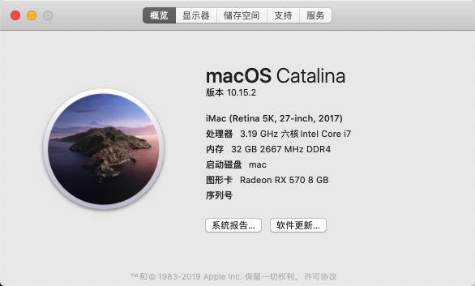
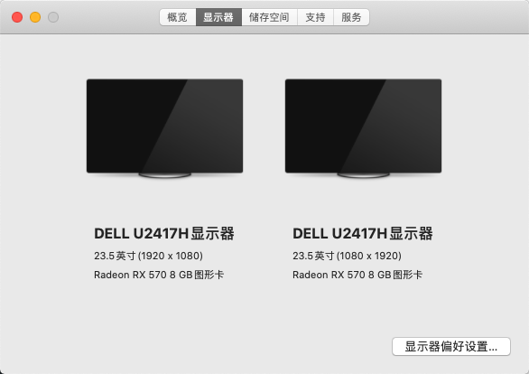
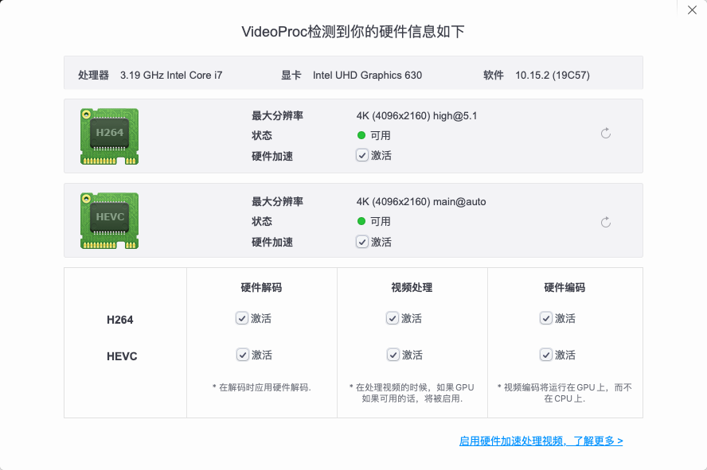

## 致谢 

感谢 [github项目Hackintosh](https://github.com/daliansky/Hackintosh) ，感谢[黑锅小兵交流群（博客？）](https://blog.daliansky.net)，感谢[youngle316分享的EFI项目](https://github.com/youngle316/ASRock-Z370M-ITX-AC)。

感谢在这过程中帮助过我的朋友。

## 使用方式

1. 在 `Releases` 中下载 `EFI`
2. 默认为 1080P 分辨率（我没有 2K/4K 屏幕。2333） 
3. 使用 `Clover Configuration` 随机一个新的序列号，以防和别人重复出现不必要的问题

## 更新日志

## 情况介绍

1. 手上有 Macmini 2012 Late （387），改了 SATA250G 固态和加了内存 16G 。但是奈何 CPU 是换不了的，都2020年了，这个双核目前是有点跟不上了，本文大概是依照 2018 Macmini 顶配的配置参照购买，附上价格。
2. 由于用惯了 Macmini，小机箱实在是爽，主板采用 ITX ，机箱是淘宝不知名品牌，总体尺寸280 X 268 X 150
3. 电源选择原因
    -  DC-ATX 在硬盘较多下，可能存在电流（还是电压？）不稳，导致毁硬盘的问题
    -  1U 的电源，普遍评价是，很吵，当然你可以自己改风扇，需要动手能力
    -  最终选择了相对稳定静音的 SFX 电源

    机箱还是放一个淘宝链接 [淘宝出品 迷你小钢炮 ](https://item.taobao.com/item.htm?spm=a1z10.1-c.w4004-21598971131.6.6df620143YKtdI&id=602050349082)  ，非利益相关，这个老板人还蛮好的。因为我不是很懂硬件，唠了一会。和品牌机箱相比，买这个机箱主要是。。便宜。
4. 暂时没有上显卡，因为暂时用不到，以及穷，但是电源配置了 450W 的全汉，也为后续留下了余地。（PS：真香了。。上了蓝宝石 RX570 8G 白金显卡。）
5. 完全不考虑 Windows & Macos 的双系统，将会采用虚拟机的方式开 Windows ，所以没有额外配置硬盘给 Windows。
6. 对于双屏需求，所以，本文会支持双屏输出：HDMI X 2 。

## 配置

| 名称 | 型号 | 购入价格 | 备注 |
| --- | --- | --- | --- |
| CPU | i7-8700 散片 |  2260 | 全新 |
| 主板 | 华擎 ASRock Z370M ITX-AC | 800 | 二手 |
| 内存 | 海盗船 DDR4 16G*2 3000MHZ | 969 | 全新 |
| 显卡 | 蓝宝石 RX570白金 8G | 588 | 二手 |
| 硬盘 1 | 三星 970 EVO 500GB M.2接口 （MacOS） | 594 | 全新 |
| 硬盘 2 | 日立 500G 2.5寸HDD （Macos 备份盘） | 115 | 全新 |
| 显示器 1 | 戴尔 DEll U2417H | - | 不计入，原有显示器 |
| 显示器 2 | 戴尔 DEll U2417H | - | 不计入，原有显示器 |
| WIFI + 蓝牙 | BCM94360CS2（免驱，替换原有网卡） | 155 | 附带转接卡 Key A M.2 NGFF ，总价155 |
| 散热器 | IDcooling LS50X | 109 | 全新 |
| 机箱 | 淘宝出品 迷你小钢炮 （没有具体型号，带两个风扇） | 合计698 | 与电源合计价格 |
| 电源 | 全汉 MS 450 | - | 与机箱合计价格 |
| 螺丝 | 淘宝买了10块钱的螺丝+静音垫圈 | 10 | - |
| 总价 | - | 6,298 | 本来没上显卡对标Mac mini 2018顶配的，上了显卡真香 |

其他：
- 这个主板，是自带网卡的，接口为：M.2 NGFF ，买了个免驱网卡，转接卡口，把原来的给拆了。但是由于转接卡超长。所以原来的屏蔽外壳，是裸露的。由于刚好是2天线，所以买的 CS2 ，如果不在意这个，可以买360CD。

## 工作情况

`working`

- CPU （自动睿频）
- GPU （核显+独显，开启硬解）
- Audio 
- Ethernet 
- WIFI
- Bluetooth
- USB ports
- Disk
- HDMI
- HDMI Audio
- Sleep/Wake
- AirPort/Handoff 

`10.15.2`

### 注意点：

1. 仿冒注入需要对应自己机器显卡 ID
2. BIOS 修改
    -  Primary Graphics Adapter : PCI Express
    -  IGPU Multi-Monitor : Enabled
    -  XHCI Hand-off : Enabled
    -  VT-d : Enabled （我要开虚拟机）
3. 机型选择 iMac 19.1
4. 附带了电源温度探测的驱动。不要可以删掉。